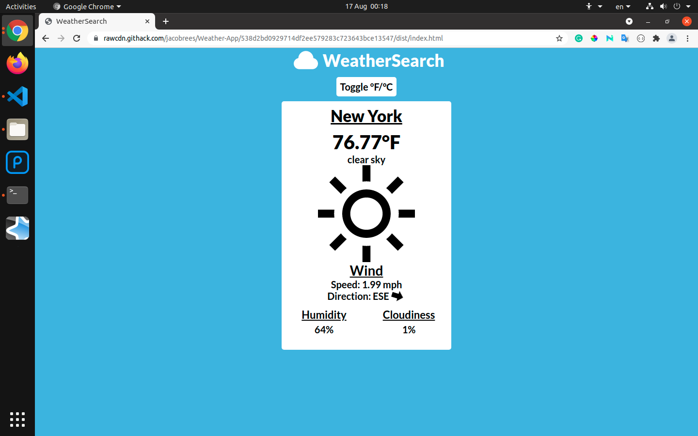

# Weather-App

> This project is an app that displays weather information based on location. This app was built using JavaScript. This is an assignment taken from _The Odin Project_. The purpose of this app was to build something that uses an API to get data.

### Todo Screenshot:



# Live Preview

[View Project](https://rawcdn.githack.com/jacobrees/Weather-App/538d2bd0929714df2ee579283c723643bce13547/dist/index.html)

# Getting Started

To get a local copy of the repository please run the following commands in your terminal:

```
$ cd <folder>
```

```
$ git clone git@github.com:jacobrees/Weather-App.git
```

To launch an instance of this app. Inside your terminal, you will need to navigate into the repository you have just cloned. You will then need to navigate inside of the dist directory. You will do this by using `cd` inside of your terminal. 

Once you are inside of this folder run the command `google-chrome index.html` and this will open the project in Google Chrome (substitute google-chrome for your prefered web browser if you wish to open in a different browser). 

Below shows the following commands you will need to run to achieve this:

```
$ cd Weather-App
```

```
$ cd dist/
```

```
$ google-chrome index.html
```

# Scripts

Below are a list of scripts you can use with Webpack.

run `npm install` to install all packages associated with project. You will need to do this before you can run any of the other commands listed below.

```
$ npm install
```

run `npm start` to start a development server.

```
$ npm start
```

run `npm run build` to bundle all code into the dist directory.

```
$ npm run build
```

## Built With

- HTML
- SCSS
- JavaScript
- Webpack
- API

## Authors

👤 **Jacob Rees**

- Github: [@jacobrees](https://github.com/jacobrees)
- Linkedin: [jacob-rees-a6507b1a6](https://www.linkedin.com/in/jacob-rees-a6507b1a6/)


## 🤝 Contributing

Contributions, issues and feature requests are welcome!

## Show your support

Give a ⭐️ if you like this project!

## Acknowledgments

- Project inspired by The Odin Project
- Code linters used within this project have been developed by Microverse
